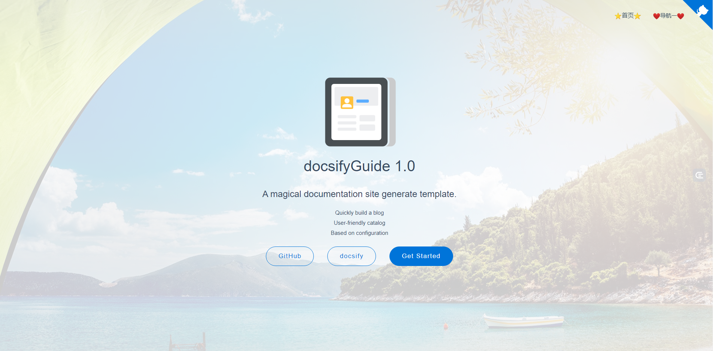
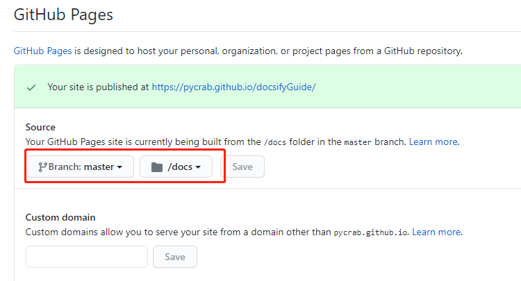
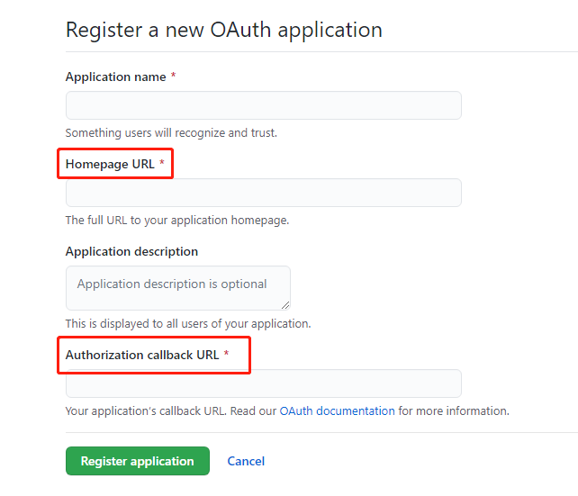

# docsify文档网站从 创建 到 ~~部署~~ 放弃 教程<!-- {docsify-ignore} -->

> 网站搭建千千万，搭完不用全白干。

肝了一个通宵用docsify搭建起来并部署到GitHub Pages，还是挺好看的，一路波折，有没有一起来玩玩的小伙伴啊:smile:。

在线预览页面：https://pycrab.github.io/docsifyGuide/

网络不流畅也可以看看码云在线预览：https://pycrab.gitee.io/docsifyguide/

## 效果展示

- 网站首页

  

- 文章页面

  
  
  

## 参考文档

- [docsify官方中文文档](https://docsify.js.org/#/zh-cn/quickstart)
- 官方文档很浅显，还需要详细解惑，[直接引用一下](https://segmentfault.com/a/1190000017576714)老哥
- 一开始还是因为看了Guide哥的[手把手这篇文章](https://mp.weixin.qq.com/s?__biz=Mzg2OTA0Njk0OA==&mid=2247486555&idx=2&sn=8486026ee9f9ba645ff0363df6036184&chksm=cea24390f9d5ca86ff4177c0aca5e719de17dc89e918212513ee661dd56f17ca8269f4a6e303&token=298703358&lang=zh_CN#rd)才开始搭建的，感谢！

## 准备

- 初始化一个GitHub仓库，并clone到本地

- 电脑已安装npm包管理工具

  全局安装docsify脚手架`npm i docsify-cli -g`，注意是安装脚手架docsify-cli，不是安装docsify！

## 快速搭建

在clone的本地仓库目录下：

- 初始化项目文件夹docs

  `docsify init docs`

- 本地预览

  `docsify serve docs`，浏览器打开localhost:3000页面即可看到。

- 全局命令启动本地预览（可选）

  - `npm init -y`初始化一个package.json文件
  - 打开并在scripts中写入`"doc": "docsify serve docs"`
  - 之后就可以使用全局命令`npm run doc`启动本地预览啦。

使用脚手架就这么简单，我还以为啥呢，但是现在是光秃秃的野人版，我们还得定制一下。

## 快速部署

> 先部署一下，后面的定制内容有可能会用到部署地址。

### 部署到GitHub Pages

仓库Settings里面开启GitHub Pages即可，注意docs路径：



### 部署到码云

- 从GitHub导入仓库
- 选择服务 - Gitee Pages

## 私人定制

刚刚我们已经初始化了一个docs文件夹，docsify在里面定义了几个文件，其中的index.html是我们的配置中心，先贴一下我依次配置了哪些内容，后面慢慢说。

```html
<!DOCTYPE html>
<html lang="en">
<head>
  <meta charset="UTF-8">
  <title>docsifyGuide</title>
  <meta http-equiv="X-UA-Compatible" content="IE=edge,chrome=1" />
  <meta name="description" content="Description">
  <meta name="viewport" content="width=device-width, user-scalable=no, initial-scale=1.0, maximum-scale=1.0, minimum-scale=1.0">

  <!-- 主题 -->
  <link rel="stylesheet" href="//cdn.jsdelivr.net/npm/docsify/lib/themes/buble.css">
  <!--<link rel="stylesheet" href="//cdn.jsdelivr.net/npm/docsify/lib/themes/vue.css">-->
  <!--<link rel="stylesheet" href="//cdn.jsdelivr.net/npm/docsify/lib/themes/dark.css">-->
  <!--<link rel="stylesheet" href="//cdn.jsdelivr.net/npm/docsify/lib/themes/pure.css">-->
  <!--<link rel="stylesheet" href="//cdn.jsdelivr.net/npm/docsify/themes/dolphin.css">-->

  <!-- 侧边栏logo样式 -->
  <style>
    .app-name-link > img{
      width: 50%;
    }
  </style>
</head>
<body>
  <!-- Loading dialog -->
  <div id="app">wait loading...</div>
  <script src="//cdn.jsdelivr.net/npm/docsify-edit-on-github"></script>
  <script>
    window.$docsify = {
      // 自定义封面
      coverpage: 'cover.md',
      // 设置了封面后，开启网站只进入封面（默认封面和首页是一页，可以向下滑动）
      onlyCover: true,

      // 主页
      homepage: 'index.md',

      // 404页面
      // notFoundPage: '404.md',

      // 导航栏
      loadNavbar: 'navbar.md',

      // 是否隐藏侧边栏
      // hideSidebar: 'true',

      // 自定义侧边栏
      loadSidebar: 'sidebar.md',
      // 侧边栏顶部标题
      name: '🏡',
      // logo和name和图标二选一
      // logo: '/media/blog.svg',
      // 侧边栏顶部标题或logo链接
      nameLink: 'https://pycrab.github.io/docsifyGuide/',
      // 侧边栏目录作为内容标题
      autoHeader: true,
      // 自定义侧边栏最大层级
      subMaxLevel: 6,

      // 小屏自动合并导航栏和侧边栏
      // mergeNavbar: true,

      // url变化自动滚动到顶部
      auto2top: true,

      // 内容距离顶部的高度
      topMargin: 10,

      // 样式主颜色
      // themeColor: '#3F51B5',

      // 右上角github小部件链接
      repo: 'https://github.com/pycrab/docsifyGuide',

      // 全文搜索
      search: {
        // （毫秒）过期时间一天
        maxAge: 86400000,
        paths: 'auto',
        placeholder: '搜一下',
        noData: '未果',
        depth: '6'
      },

      // 路由映射，固定根目录的文件
      alias: {
        '/.*/sidebar.md': '/sidebar.md',
        '/.*/navbar.md': '/navbar.md'
      },

      // edit-on-github
      plugins: [
        // 末尾的/是必要的
        EditOnGithubPlugin.create('https://github.com/pycrab/docsifyGuide/blob/master/docs/')
      ],

      // 谷歌分析
      // ga: 'UA-XXXXX-Y'
    }
  </script>
  <script src="//cdn.jsdelivr.net/npm/docsify/lib/docsify.min.js"></script>

  <script src="//cdn.jsdelivr.net/npm/docsify-copy-code"></script>
  <script src="//unpkg.com/docsify-count/dist/countable.js"></script>
  <script src="//unpkg.com/prismjs/components/prism-java.js"></script>
  <script src="//cdn.jsdelivr.net/npm/docsify/lib/plugins/emoji.min.js"></script>
  <script src="//cdn.jsdelivr.net/npm/docsify/lib/plugins/search.min.js"></script>
  <script src="//cdn.jsdelivr.net/npm/docsify/lib/plugins/zoom-image.min.js"></script>
<!--  <script src="//cdn.jsdelivr.net/npm/docsify/lib/plugins/ga.min.js"></script>-->

  <!-- 评论 -->
  <link rel="stylesheet" href="//cdn.jsdelivr.net/npm/gitalk/dist/gitalk.css">
  <script src="//cdn.jsdelivr.net/npm/gitalk/dist/gitalk.min.js"></script>
  <script src="//cdn.jsdelivr.net/npm/docsify/lib/plugins/gitalk.min.js"></script>
  <script>
    const gitalk = new Gitalk({
      clientID: '2e9677843c4746472164',
      clientSecret: '7af6573bbab3cd4a94fd27dbf178d6c6c119a025',
      repo: 'docsifyGuide',
      owner: 'pycrab',
      admin: ['pycrab'],
      distractionFreeMode: true
    })
  </script>
</body>
</html>
```

看到这密密麻麻的中文注释，是不是已经跃跃欲试了呢？继续。

### 主题设置

目前已经更新了五种主题，我已经列出来了，可以[在这里在线预览](https://docsify.js.org/#/zh-cn/themes?id=%e7%82%b9%e5%87%bb%e5%88%87%e6%8d%a2%e4%b8%bb%e9%a2%98)各种主题。

### 封面设置

> 默认是不启用封面的，直接是正文。

我们可以[配置开启](https://docsify.js.org/#/zh-cn/configuration?id=coverpage)。这里我主要说一下自定义封面：

- 配置`coverpage: 'cover.md'`
- 在docs文件夹下新建cover.md文件，内容格式如下，注意里面内容的顺序一定不要变：

```
<!-- logo标识，media为我们在docs中创建的素材文件夹 -->


<!-- 以下封面描述 -->
# docsifyGuide 1.0

> A magical documentation site generate template. 

- Quickly build a blog
- User-friendly catalog
- Based on configuration

<!-- 以下为链接，空格分隔 -->
[GitHub](https://github.com/pycrab/docsifyGuide) [docsify](https://docsify.js.org/#/quickstart)  [Get Started](index)

<!-- 这个是封面背景图，不配置的话，是随机的颜色 -->


<!-- 固定封面背景色，不配置的话，背景是随机的颜色，背景色和背景图只能同时配置一个 -->

```

开启封面后，默认网页进入封面和首页，首页在封面下方，是一页可以上下滑动，我们可以设置访问首页时只进入封面，通过封面链接进入首页：`onlyCover: true`。

### 主页设置

> 设置你的主页`homepage: 'index.md'`，即网站第一页，一般放网站内容概述。

### 404页面设置

> 可以自定义404页面`notFoundPage: '404.md'`。

### 导航栏设置

> 默认不开启，我们可以设置`loadNavbar: 'navbar.md'`来指定导航栏。

- 在docs文件夹下新建navbar.md文件，内容格式如下：

  ```
  - [我是导航一](/)
  - 我是导航二
  	- [我是二级导航](/p/guide)
  	- [我是二级导航](/p/custom)
  ```

- 有几个注意事项

  **以下规则也适用于自定义的侧边栏**。

  - 导航路径一般都设置相对路径，`/` 会链接到主页（如果开启封面会到封面）

  - 导航加载的时候会去寻找配置的文件夹，比如这里配置的是navbar.md。它会根据页面所属目录一直向父目录寻找，比如/a/b/c.md文件打开，它会先去寻找b目录有没有navbar文件，没有就朝上找a目录下是否有，找不到就不能正常加载导航，但是不影响页面。

  - 我们一般不会每个目录都创建导航，所以设置一下只使用根目录的导航文件：

    ```js
    alias: {
    	'/.*/navbar.md': '/navbar.md'
    }
    ```

    

### 侧边栏设置

> 终于到了最重要的侧边栏设置了:🙋‍♂️:，挺住

- 首先侧边栏是默认开启的，但是是针对单页面的，它会将页面里的目录当作侧边栏展示。

- 如果我们不需要展示，可以关闭` hideSidebar: 'true'`

- 但是网站我们一般都需要展示，并且多页面之间可以跳转，所以我们得手动指定一下导航目录

  - 指定侧边栏`loadSidebar: 'sidebar.md'`

  - 在docs文件夹下新建sidebar.md文件，文件内容格式如下：

    ```
    - [我是一级标题](/ "我是可爱的title")
    - 我是一级标题(/p/index  "我是自定义的title")
    	- [我是二级标题](/p/guide)
    	- [我是二级标题](/p/custom)
    ```

    可以看到，我们手动指定了导航目录，并且还自定义了页面的title标签。

  - 你可能会问，那我文章里面的目录呢，总不能都手动写到这个文件里吧，当然不会，文章里的目录会自动渲染到你这里定义的链接下面，这样层级就出来了。这里我们还需要设置一下文章的内容层级数`subMaxLevel: 6`，一共就六个层级1-6，我这里设置最大。

  - 和导航栏类似的，我们也需要指定一下只使用根目录的侧边栏文件：

    ```js
    alias: {
        '/.*/navbar.md': '/navbar.md'
    }
    ```

- 好了，这里侧边栏目录是有了，还有几个小东西可以配置一下：

  - 设置侧边栏的目录名作为正文的标题`autoHeader: true`

  - 侧边栏顶部标题`name: 'docsifyGuide'`

  - 侧边栏顶部放一个logo`logo: '/media/blog.svg'`，logo和标题是二选一

    这里的logo大小也是可以设置的，给它加个样式就行，比如：

    ```css
    <head>
    <!-- 侧边栏logo样式 -->
      <style>
        .app-name-link > img{
          width: 50%;
        }
      </style>
    </head>
    ```

  - 侧边栏顶部标题/logo的超链接`nameLink: 'https://pycrab.github.io/docsifyGuide/'`

### 插件设置

#### 全文搜索

- 引入

  `<script src="//cdn.jsdelivr.net/npm/docsify/lib/plugins/search.min.js"></script>`

- 配置一下

  ```json
  search: {
      // （毫秒）过期时间一天
      maxAge: 86400000,
      paths: 'auto',
      placeholder: '搜一下',
      noData: '未果',
      depth: '6'
  }
  ```

#### edit-on-github快速编辑文件

- 引入，这一行脚本一定要放在配置之前！

  `<script src="//cdn.jsdelivr.net/npm/docsify-edit-on-github"></script>`

- 配置，这里改成你的仓库

  ```
  plugins: [
    // 末尾的/是必要的
    EditOnGithubPlugin.create('https://github.com/pycrab/docsifyGuide/blob/master/docs/')
  ]
  ```

#### 代码复制

- 引入

  ` <script src="//cdn.jsdelivr.net/npm/docsify-copy-code"></script>`

#### 代码格式化

- 引入

  ` <script src="//unpkg.com/prismjs/components/prism-java.js"></script>`

#### 字数统计

- 引入

  `<script src="//unpkg.com/docsify-count/dist/countable.js"></script>`

#### 图片缩放查看

- 引入

  ` <script src="//cdn.jsdelivr.net/npm/docsify/lib/plugins/zoom-image.min.js"></script>`

#### 表情插件

- 引入

  ` <script src="//cdn.jsdelivr.net/npm/docsify/lib/plugins/emoji.min.js"></script>`

#### 谷歌分析

- 引入

  `<script src="//cdn.jsdelivr.net/npm/docsify/lib/plugins/ga.min.js"></script>`

- 获取trace_id

  - https://analytics.google.com/analytics/web/provision/#/provision

- 配置`ga: 'trace_id'`

#### 评论插件

- 引入

  ```
    <link rel="stylesheet" href="//cdn.jsdelivr.net/npm/gitalk/dist/gitalk.css">
    <script src="//cdn.jsdelivr.net/npm/gitalk/dist/gitalk.min.js"></script>
    <script src="//cdn.jsdelivr.net/npm/docsify/lib/plugins/gitalk.min.js"></script>
    <script>
      const gitalk = new Gitalk({
        clientID: '2e9677843c474642164',
        clientSecret: '7af6573bbab3cd4a94fd27dbf18d6c6c119a025',
        repo: 'docsifyGuide',
        owner: 'pycrab',
        admin: ['pycrab'],
        distractionFreeMode: true
      })
    </script>
  ```

- 里面的配置项获取

  - github settings设置里，找到Developer settings，在OAuth Apps新建一个

    

  - 之后将分配的id配置一下就好了

### 其他设置

#### 自动滚动到顶部

> 当切换标签时自动滚动到顶部`auto2top: true`。

#### 样式主颜色

> 设置github角标、引用等样式颜色`themeColor: '#3F51B5'`

#### 标签距离顶部的距离

> 点击标签（菜单导航）会定位到具体的标签并滚动到顶部，设置距离顶部的高度`topMargin: 10`

---

:ok_man:，这里到底了，博客搭建完成，一起看看吧！